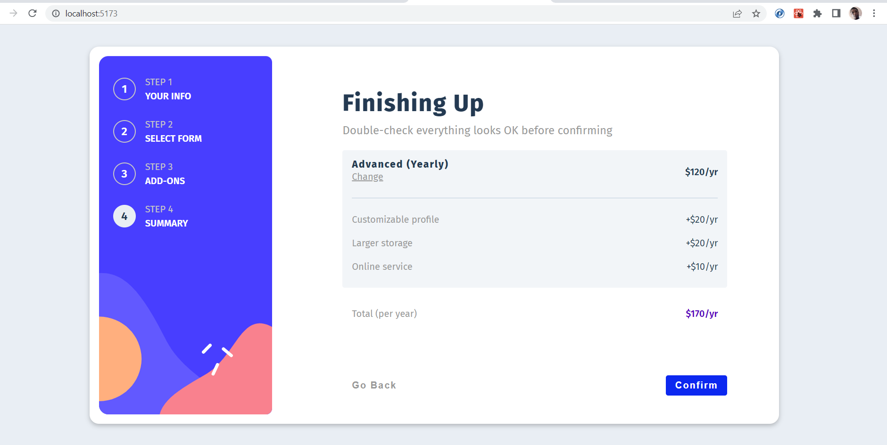

# Frontend Mentor - Multi-step form solution

This is a solution to the [Multi-step form challenge on Frontend Mentor](https://www.frontendmentor.io/challenges/multistep-form-YVAnSdqQBJ).

## Table of contents

- [Overview](#overview)
  - [The challenge](#the-challenge)
  - [Screenshot](#screenshot)
  - [Links](#links)
- [My process](#my-process)
  - [Built with](#built-with)
  - [What I learned](#what-i-learned)
- [Author](#author)
- [Acknowledgments](#acknowledgments)

## Overview

### The challenge

Users should be able to:

- Complete each step of the sequence
- Go back to a previous step to update their selections
- See a summary of their selections on the final step and confirm their order
- View the optimal layout for the interface depending on their device's screen size
- See hover and focus states for all interactive elements on the page
- Receive form validation messages if:
  - A field has been missed
  - The email address is not formatted correctly
  - A step is submitted, but no selection has been made

### Screenshot



### Links

- Live Site URL: [https://multi-form-wizard.netlify.app/](https://multi-form-wizard.netlify.app/)

## My process

### Built with

- REACT
- STYLED COMPONENTS

### What I learned

I learned how to create a user-friendly and responsive multistep form that enhances the user experience by allowing them to complete the form at their own pace, easily navigate back and forth between steps, and receive helpful validation messages, resulting in a more efficient and error-free form submission process.

```styled-components CSS
background-color: ${({ selected }) =>
    selected ? "var(--clr-grey-10)" : "none"};
```

```js
const calculateTotal = () => {
  const planPrice = plan[duration];
  const addonsTotal = addOns.reduce((total, addon) => {
    const price = data.find((p) => p.name === addon)[duration];
    total += price;
    return total;
  }, 0);
  return addonsTotal + planPrice;
};
```

## Author

- Website - [Onosereme Emuemhonjie](https://onosereme.netlify.app)
- Frontend Mentor - [@onoseremejohn](https://www.frontendmentor.io/profile/onoseremejohn)
- Twitter - [@onoseremejohn](https://www.twitter.com/onoseremejohn)

## Acknowledgments

- I would like to express my deep appreciation and gratitude to God, without whose guidance and blessings, this project would not have been possible.
- I am also thankful for the invaluable support and assistance provided by ChatGPT, whose contributions greatly improved the quality of my work and sped up my workflow.
